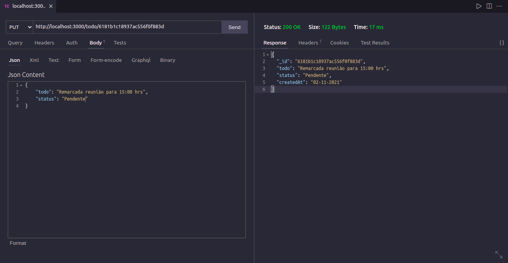

  

<h1 align="center">Ebytr To Do API</h1>

An API where informations about tasks can be entered or returned 

## Functions:

 

* Create/Insert a task(POST)

 

  

 

* Find all tasks(GET)

 

  

 

* Find a task by id(GET)

 

  

 

* Modify an information(PUT)

 

  

 

* Delete a task(DELETE)

 

  

 

## Main Used Technologies

* JavaScript
* Node.js
* Express
* mongodb(dependency to access database MongoDB)

## To Run Locally

Clone the project

`git clone https://github.com/andrearnoni/Ebytr-to-do-API.git`

Go to the project directory

`cd Ebytr-to-do-API`

Install dependencies

`npm install`

Start the server

`npm start`

## Notes:

* To test the API you can use the browser for some functions or an application like [Postman](https://www.postman.com) or [Insomnia](https://insomnia.rest) to a complete experience.
* The application has a file called **.env.example** to show examples of environment variables that connect with database in MongoDB and a localhost port. 

## Author

This project was coded by [@andrearnoni](https://github.com/andrearnoni).

### Go to my [Portfolio!](https://andrearnoni.vercel.app/) 
### Connect with me at [LinkedIn!](https://www.linkedin.com/in/andrearnoni/) 